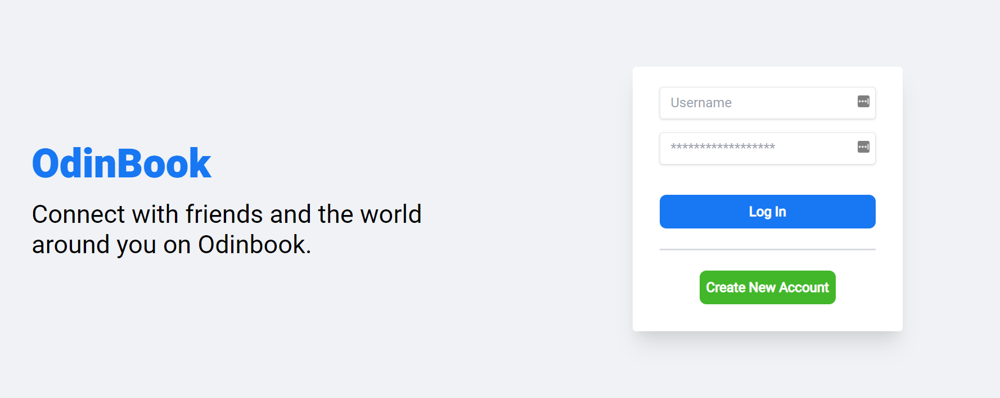

<h1 align="center">
[The Odin Project: Node] - Project: OdinBook Client
</h1>

<p align="center">
  <a href="https://blog-sal-admin.netlify.app/">
    
  </a>
</p>

## Intro

-   The repos associated with project:
    [OdinBook API](https://github.com/salvillalon45/theOdinProject-OdinBookApi)
-   This is the client view for the OdinBook project. This is part of the Final Project for the Node Module. The overall project is to create an api and build a client that will make requests to this api. The idea is to create a minimal replica of Facebook
-   For this project, I decided to practice the following:
    -   SWR Hooks
    -   Gatsbys
    -   JS Refactoring and Reusability
-   You can find more on the project here: [The Odin Project - OdinBook](https://www.theodinproject.com/paths/full-stack-javascript/courses/nodejs/lessons/odin-book)

### Demo

https://user-images.githubusercontent.com/18276475/147182644-d15616e4-2e53-469b-8601-8c27b1e2f0b0.mp4

### 📗 Fonts used

-   [Heebo](https://fonts.google.com/specimen/Heebo?preview.text=Friends&preview.text_type=custom&thickness=6&category=Sans+Serif#standard-styles)
-   [Roboto](https://fonts.google.com/specimen/Roboto?preview.text=Back%20at%20volunteering&preview.text_type=custom&category=Sans+Serif)

### 🎨 Color Reference

|  Color            |  Hex                                                                 |
| ----------------- | -------------------------------------------------------------------- |
| Blue              |   `#1877F2`  |
| Red               |  `#FF0000`   |
| Green             |   `#42b72a`  |
| Grey Hover        |  `#e4e6e9`   |
| Grey              |  `#d8dadf`   |
| Dark Grey         |  `#66676c`   |
| Grey Background   |   `#f0f2f5`  |

## Overall

-   This project was a big challenge. The challenge came since I was trying out various new things such a

    -   **TypeScript**: I was getting more comfortable with JS. The next step was for me to try TS out and saw a great value in this
    -   **SWR Hooks**: I was used to using `fetch` to make my request, but I learned that SWR hooks can add better fetching to applications so I decided to try it out
    -   **JS Refactoring and Reusable Code**: I challenged myself to see areas that can either turn into a reusable component or utility. Most of my code in this repo is reusable code and utilities!

-   **TypeScript:**

    -   I learned how to setup a Gatsby + TypeScript project thanks to this video: https://youtu.be/Mf8eqNrcZDw
    -   Then through documentation and the video above I learned how to annotate functions, create types to define the data I am passing around in functions or getting from request calls
    -   TypeScript at first was challenging to adapt to, but the benefits are great. It is easier to detect bugs. Without TS, we sometimes pass the wrong data in functions without knowing. Every function must have annotated parameters this made it easier to know what the code is expecting. Similary to how Java does it which is great. I really like this. It makes my code more secure

-   **SWR Hooks**

    -   **Resources for SWR Hooks**
        -   https://www.ibrahima-ndaw.com/blog/data-fetching-in-nextjs-using-useswr/
        -   https://benborgers.com/posts/swr-refresh
        -   [What is isValidating](https://github.com/vercel/swr/discussions/563)
    -   SWR Hooks is a game change to web development. In the previous project I will use the useEffect hook and will have to create isLoading and errors state variables [Similar to how it is done here](https://reactjs.org/docs/faq-ajax.html)
    -   SWR removes all of this since the hook comes with the variables needed to check if their are errors or if data is still loading
    -   **SWR over Redux and React Context**
        -   Also, I remember in the beginning I was getting confused whether to use the React Context to store my data and pass it around in components or just use SWR hooks. It was until this blog [Using SWR](https://blog.aamnah.com/react/using-swr-react-hook). The blog explained how Vercel does not use redux since they can just use the swr hook in any component that needs the data
        -   Using SWR Hooks allows us to not have to use Redux or React Context. With swr, I can use this hook at the top parent level or child level components. [Check out this example](https://swr.vercel.app/docs/getting-started#example)
    -   **Refreshing Data**
        -   Thanks to this blog: [How to refresh data with SWR](https://benborgers.com/posts/swr-refresh). I learned how to use the mutate function and the isValidating flag that is bound to the instance of useSWR hook. An explanation, let's say that the user created a new post. You then call the mutate function associated with that hook to refresh the data, then use the isValidating flag to show a message saying that the data is getting updated
    -   **Using useSWRInfinite to implement loading of more data**
        -   I was looking for a way to load more posts since if I loaded all the posts at the same time it will take more time for the app to load. I wanted to do it similarly to how Facebook does it
        -   That is when I found the Infinite Loading feature using [useSWRInfinite](https://swr.vercel.app/docs/pagination#infinite-loading)
        -   This another example of how to use it [useSWRInfinite Code](https://swr.vercel.app/examples/infinite-loading)
        -   I was following the code, but my problem was with the backend since I was not implementing it properly. I need to learn how to use Skip and Limit on Mongoose. Thanks to this article it made it clear [Simple Pagination with Node.js, Express, and Mongoose](https://javascript.plainenglish.io/simple-pagination-with-node-js-mongoose-and-express-4942af479ab2)
    -   **Creating My Own Hooks**

        -   Since I needed to use hooks to various other functionalities. I create four hooks that I used throughout the application. Example: https://swr.vercel.app/docs/getting-started#make-it-reusable

        ```
        function usePosts(
          userid: string,
          authorization: string
        ): UsePostHookReturnType {
          const { data, error: errors } = useSWR(
            [`${process.env.GATSBY_ODIN_BOOK}/posts/${userid}`, authorization],
            fetcher
          );

          return {
            allPosts: data,
            isLoading: !errors && !data,
            isError: errors
          };
        }
        ```

    -   **Child and Parents Passing Down Data**
        -   I had a bug where I was creating a new post then the postitem will get render but without the picture I attached to the post. After debugging, I realized that the data that was being passed down to the component was updated but since the child component also had a `usePosts` hook, this hook was retrieving outdated data!
        -   To fix it, in the `handleNewPostSubmit()` used in the `MiddleContent.tsx` file I needed to call the global `mutate()` function so that all the usePosts hook will get the updated data
        -   I need to be careful and plan ahead how I am going to organize and retrieve data for child and parent components

-   **JS Refactoring and Reusable Code**

    -   One area that I noticed was that most of the files are using many of the reusable functions and components I created.
    -   In this application, I noticed a lot of things that were getting repeated. Such as a Button component. My Button component improved drastically from last project. This button became even more reusable.
    -   I created 13 reusabled components and three util files with their set of functions.
        -   apiUtils: to handle api calls
        -   authUtils: to handle authentication tooling
        -   utils: to handle logic that is used in components
    -   I learned (ES7 Object Rest Operator to Omit Properties)[https://stackoverflow.com/questions/37838778/destructuring-object-and-ignore-one-of-the-results]
        -   ```
            // Here we remove the password from the currentUser object
            const { password, ...currentUser } = user;
            ```
    -   **When to use forEach and Map**

        -   Learned that if I want a flat result from nested loops. It will not work with map I need to use a forEach https://stackoverflow.com/questions/51743372/javascript-nested-map-returning-multiple-arrays

        ```
        If you want a flat result, this isn't a use case for map. The simple solution is just to use an array you close over and push to:

        const result = [];
        firstData.forEach(first => {
            return first.secondData.forEach(second => {
                result.push(...second.thirdData.filter(third => third.value === 'whatever'));
            });
        });
        ```

## Next Steps

-   This was the last project of the Node Module. I learned a lot and I am grateful that this curriculum exists since I like how the whole course is organize to teach us the basics then step by step giving us more challenges. Each project I learned something new and I am proud of all that I did. Now that I am done with this module, this are some of the things I am looking forwards to;

-   **Moving Forward**

    -   **Proficient Frontend Developer**

        -   I want to become a proficient Frontend developer. My goal is to get involved with projects that use React, Gatsby, or NextJS as their Frontend stack. I want to know how it is used in industry

    -   **Gatsby + GraphQL + TypeScript + Apollo**

        -   Next I want to learn how to build a Gatsby + GraphQL + TypeScript + Apollo client. I know that web development is transitioning to using query languages like GraphQL to fetch data instead of REST due to all the benefits it brings. I want to learn how to create one so that I am more comfortable with GraphQL!

    -   **Getting Familiar With Nested Pages**

        -   In my current implementation I thought I was doing nested pages which I partly did, but it was not fully since the `index.tsx` of home was not getting called when accessing `/home/user/:userid`
        -   This tells me that I need to see a youtube video to learn how to properly do it

    -   **Learning How To Create Reusable Hooks**
        -   I am proud that I created my first hook, but I noticed that three of the hooks I created were very similar. I am going to learn how to improve this. I found this articles
            -   [Clean and reusable data fetching in React components](https://dev.to/rikurouvila/clean-and-reusable-data-fetching-in-react-components-165)
            -   [Clean API Call With React Hooks](https://betterprogramming.pub/clean-api-call-with-react-hooks-3bd6438a375a)
    -   **Proper User of Gastby SEO Component**
        -   I want to practice SEO since everytime I try adding the SEO component and share the link in a Facebook messge I never get to see the preview of the link
    -   **Organize Data Passing in Child and Parents Components**
        -   One point of confusion is understanding that since we are using SWR hook we might not need to pass down data to child components since they can just retrieve with the hook. I want to learn how to best structure the components

-   **Errors Could Not Fix**

    -   **Using useStaticQuery**

        -   When I tried using this hook inside the SEO component to retrieve the graphql query data I will get this error
        -
        -   Other people encountered this error but did not have a solution
            -   https://github.com/gatsbyjs/gatsby/issues/24515
            -   https://github.com/gatsbyjs/gatsby/issues/30458
            -   https://github.com/gatsbyjs/gatsby/discussions/30465

    -   **Favicon Not Available**

        -   I was not able to load the favicon for the site using the gatsby-plugin-manifest. Even though I was doing the same thing that I did on my previous projects. Next time I am going to start the project using the gatsby default starter

    -   **TS Type for PageProps**
        -   Also I could not solve this errors I got from TypeScript
        -   
        -   What I am doing is retrieving the userData that I include from the dynamically build page, but since it is from PageProps I am guessing that I had to create a type that included all the fields from PageProps.PageContext and include the type of UserData
        -   This might be the similar case for the other error I have
        -   Update. I tried this but it did not work for me. Need to see how this is used. Need tutorials in Gatsby and TypeScript

## Technologies:

-   Gatsby
-   Tailwind
-   Netlify
-   JWT
-   SWR Hooks
-   Material UI
-   React Context
-   TypeScript
